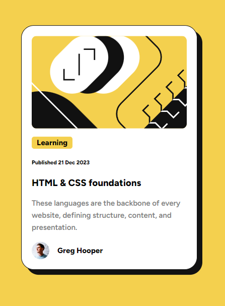

# Frontend Mentor - Blog preview card solution

This is a solution to the [Blog preview card challenge on Frontend Mentor](https://www.frontendmentor.io/challenges/blog-preview-card-ckPaj01IcS). Frontend Mentor challenges help you improve your coding skills by building realistic projects.

## Table of contents

- [Overview](#overview)
  - [The challenge](#the-challenge)
  - [Screenshot](#screenshot)
  - [Links](#links)
- [My process](#my-process)
  - [Built with](#built-with)
  - [What I learned](#what-i-learned)
  - [Continued development](#continued-development)
  - [Useful resources](#useful-resources)
- [Author](#author)
- [Acknowledgments](#acknowledgments)

**Note: Delete this note and update the table of contents based on what sections you keep.**

## Overview

### The challenge

Users should be able to:

- See hover and focus states for all interactive elements on the page

### Screenshot



### Links

- Solution URL: [Github](https://github.com/BelaGereon/blog-preview-card/tree/feature/blog-preview-card)
- Live Site URL: [Github Pages](https://belagereon.github.io/blog-preview-card/)

## My process

### Built with

- Semantic HTML5 markup
- CSS custom properties
- Flexbox

### What I learned

One aspect that I haven't really thought about or used yet was using different preconfigured custom styles for font types to use them as extra classes withing the HTML. By doing it this way it is very easy to control the font-weight and other related stuff directly from the HTML, which makes it also super easy to see what's going on when looking at the html for the first time.

```html
<div class="text-content flex-container__column">
  <div class="heading">
    <h3 class="font-heavy">HTML & CSS foundations</h3>
  </div>
  <div class="summary">
    <p class="font-normal">
      These languages are the backbone of every website, defining structure,
      content, and presentation.
    </p>
  </div>
</div>
```

```css
.font-heavy {
  font-family: "Figtree", sans-serif;
  font-optical-sizing: auto;
  font-weight: 800;
  font-style: normal;
}

.font-normal {
  font-family: "Figtree", sans-serif;
  font-optical-sizing: auto;
  font-weight: 600;
  font-style: normal;
}
```

### Continued development

I'm thinking about using web-components for plain HTML / CSS / JS - Projects to make better use of reusable code. This is more relevant in bigger projects obviously, but a using these challenges from Frontend Mentor as a first web-component playground can be a nice next step in my web-dev-journey.

### Useful resources

- [A Modern CSS Reset](https://www.joshwcomeau.com/css/custom-css-reset/) - This blogpost is really well written and gives a very good explanation for all the different style resets that are used here.

## Author

- Frontend Mentor - [@BelaGereon](https://www.frontendmentor.io/profile/BelaGereon)
